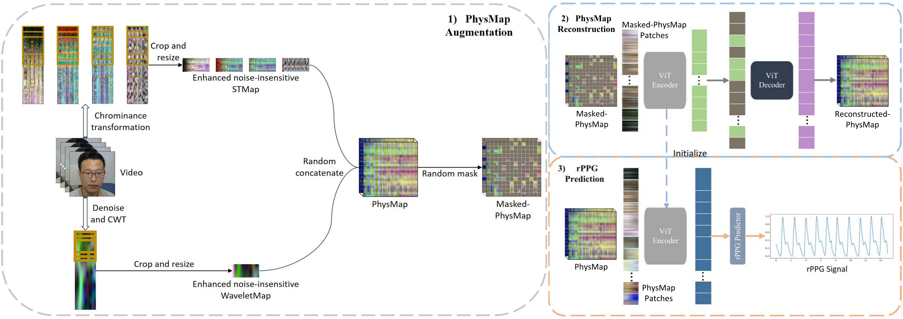
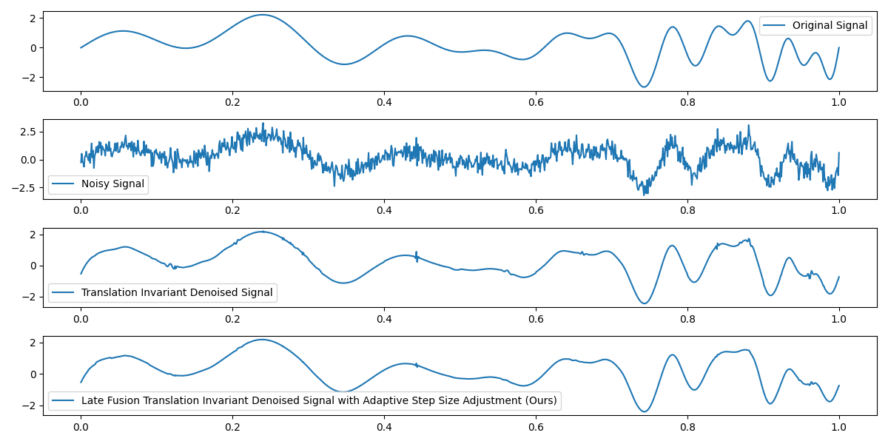

# STW-MAE: Self-supervised Pretraining with Masked Autoencoders for Remote Physiological Measurements Based on Spatial-temporal Map and Wavelet Map

## Abstract
This repository presents STW-MAE, a novel self-supervised learning framework for remote photoplethysmography (rPPG) measurement. Our method integrates two key physiological representations:
1. **Spatial-temporal Map (STMap)**: Captures spatio-temporal blood volume pulse variations
2. **Wavelet Map**: Encodes time-frequency characteristics of physiological signals

The proposed masked autoencoder (MAE) architecture achieves state-of-the-art performance on the PURE dataset with:
- MAE: 0.39
- RMSE: 0.56

## Key Features
- 🧠 **Self-supervised pretraining** requiring no labeled data
- ⚡ **Efficient ViT-based architecture** for physiological signal reconstruction
- 🌐 **Multi-modal physiological representation** combining spatial-temporal and wavelet features
- 🏆 **SOTA performance** on benchmark datasets

## Methodology

The framework of STW-MAE.

The CWT computed from the original signal segment of a test subject.

Ablation study of wavelet denoising methods.

### Core Components:
1. **PhysMap Construction**
   - STMap from ROI tracking
   - Wavelet Map via Continuous Wavelet Transform
   - Fusion: $P_r^i = {\rm{Concat}}\left( {ST_r^i,W_r^i} \right)$

2. **MAE-based Pretraining**
   - 80% random masking strategy
   - Dual reconstruction targets:
     - Pixel-level MSE loss
     - Physiological consistency loss

3. **Fine-tuning for rPPG**
   - Heart rate prediction head
   - Frequency-domain cross-entropy loss

### References:
1. Liu X, Zhang Y, Yu Z, et al. rPPG-MAE: Self-supervised pretraining with masked autoencoders for remote physiological measurements[J]. IEEE Transactions on Multimedia, 2024.
